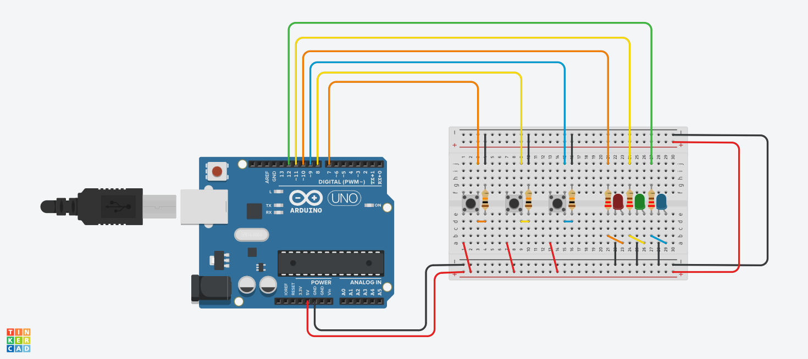

# 🔌 Arduino Circuit: 3 Buttons & 3 LEDs

This project is an **electronic circuit** built using **Arduino UNO**, created in **Tinkercad**. It connects **3 push buttons** to **3 LEDs**, allowing each button to control one LED individually. The circuit demonstrates the basics of **digital input/output** in embedded systems.

---

## 🎯 Objectives

- Understand how to use digital input (push buttons) and digital output (LEDs) with Arduino.
- Practice circuit building and wiring on a breadboard.
- Simulate real-time interaction using Tinkercad and Arduino code.

---

## 🪛 Components Used

| Quantity | Component      |
|----------|----------------|
| 1        | Arduino UNO    |
| 3        | Push Buttons   |
| 3        | LEDs (Red, Green, Blue) |
| 3        | 220Ω Resistors |
| 1        | Breadboard     |
| –        | Jumper Wires   |

---

## ⚙️ How the Circuit Works

- Each button is connected to a digital input pin.
- Each LED is connected to a digital output pin.
- When a button is pressed, the corresponding LED lights up.

| Button | Arduino Pin | LED | LED Pin |
|--------|--------------|-----|---------|
| Button 1 | 7 | LED 1 (Red)   | 10 |
| Button 2 | 8 | LED 2 (Green)| 11 |
| Button 3 | 9 | LED 3 (Blue) | 12 |

---

## 🧠 Arduino Code

```cpp
const int button1 = 7;
const int button2 = 8;
const int button3 = 9;

const int led1 = 10;
const int led2 = 11;
const int led3 = 12;

void setup() {
  pinMode(button1, INPUT);
  pinMode(button2, INPUT);
  pinMode(button3, INPUT);

  pinMode(led1, OUTPUT);
  pinMode(led2, OUTPUT);
  pinMode(led3, OUTPUT);

  digitalWrite(led1, LOW);
  digitalWrite(led2, LOW);
  digitalWrite(led3, LOW);
}

void loop() {
  if (digitalRead(button1) == HIGH) {
    digitalWrite(led1, HIGH);
  } else {
    digitalWrite(led1, LOW);
  }

  if (digitalRead(button2) == HIGH) {
    digitalWrite(led2, HIGH);
  } else {
    digitalWrite(led2, LOW);
  }

  if (digitalRead(button3) == HIGH) {
    digitalWrite(led3, HIGH);
  } else {
    digitalWrite(led3, LOW);
  }
}
```

---

## 🛠 Tools Used

- [Tinkercad](https://www.tinkercad.com) Circuits – For simulation and design.
- Arduino UNO – For coding and testing the circuit.
- Screenshot – Captured from the simulation.

---

## 📸 Screenshots



---

## ✨ What I Learned

- How to build a basic input/output circuit using Arduino.
- The role of pull-down resistors and how buttons are read digitally.
- How to write and upload code to an Arduino board for real-time interaction.

---

## 📌 Notes

- The circuit was built and tested virtually using Tinkercad Circuits.
